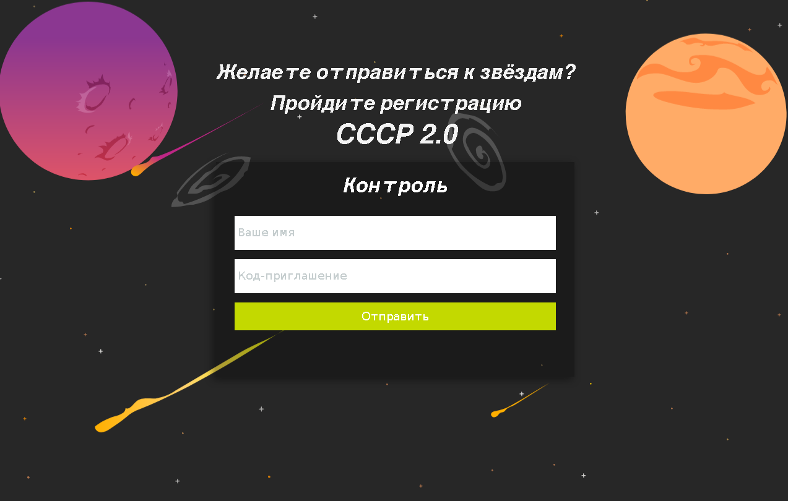

## Таможня

| Событие | Название | Категория | Сложность |
| :------ | ---- | ---- | ---- |
| VKA-CTF`2021 | Таможня | Crypto | easy |

### Описание

> Автор: iC0nst
>
> В начале эры космических путешествий первые полеты через пояс астероидов были губительными для кораблей из-за отстутствия подробных карт данного сектора. Коммунисты обезопасили эти пути, проложили хорошие маршруты, однако установили свои КПП по всему переметру пояса и объявили на него монополию. Теперь для доставки грузов к дальним планетам Солнечной системы нашим кораблям необходимо платить пошлину и получать разрешение на преодоление контролируемой зоны. Благо наши информаторы позволили получить исходники их чек-системы. Сейчас нашему кораблю необходимо пробраться через пояс астероидов, не привлекая лишнего внимания и не оплачивая пролёт, поэтому нужна помощь. Кстати, с прошлой поездки остался правильный промо-код MTIzNDU2Nzg5MGFiY2RlZr7jTXZkUuVLL3iBvgNTY0s= на имя Ivan.
[файл](give/validator.go)
### Решение



Для прохождения контроля необходимо предоставить промо-код и имя. Ознакомившись с исходными кодами, можно убедиться в том, что сервис расшифровывает промо-код и проверяет, равен ли он введённому имени. Криптографическая часть сервиса включает в себя  шифр Kuznechik, дополнение (aka padding) согласно PKCS №7 и режим шифрования CBC. 

Поскольку вектор инициализации (IV) контролируется пользователем, а какая-либо проверка подлинности передаваемого промо-кода (например, ЭЦП) отсутствует, есть возможность проведения атаки bit-flipping путём подделки IV.

 ```python 
intialCode = "MTIzNDU2Nzg5MGFiY2RlZr7jTXZkUuVLL3iBvgNTY0s="
iv = b64decode(intialCode)[:16]
code = b64decode(intialCode)[16:]

givenName = "Ivan"
newName = "Avan"

baIV = bytearray(iv)
baIV[0] = baIV[0] ^ ord(newName[0]) ^ ord(givenName[0])

newCode = b64encode(bytes(baIV) + code).decode()
```


**Флаг:**

> vka{you_are_allowed_to_pass}
