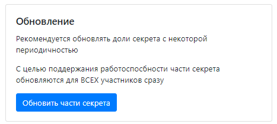
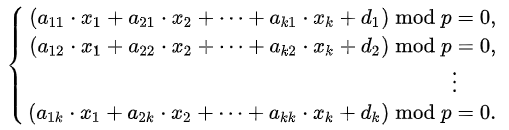

## Центр управления

| Событие | Название | Категория | Сложность |
| :------ | ---- | ---- | ---- |
| VKACTF 2021 | Центр управления | Crypto | medium |

### Описание

> Автор: iConst
>
>У СССР 2.0 всё в духе коллективизма: даже панель управления защищена протоколом разделения секрета. Пароль/логин для входа оказались дефолтными - admin:admin. Осталось найти общий секрет для доступа к конфиденциальной информации.
[файл](give/SecretSharingLib.py)
### Решение

Изучив исходный код сервиса, можно убедиться, что представлен протокол разделения секрета по схеме Блэкли (векторная схема разделения секрета). 

Секрет в схеме Блэкли представляет собой точку в n-мерном пространстве, для определения которой требуется n уравнений гиперплоскостей. 

Ход решения:

1. Имеется 4 участника, следовательно, для восстановления общего секрета необходимо 4 уравнения гиперплоскостей. Стоит отметить, что векторная схема предполагает использование **только одной** координаты точки в качестве секрета, остальные же являются случайными числами. В данной реализации это требование не выполняется, поскольку парольная фраза "разбивается" на все координаты секретной точки. Чтобы их получить достаточно 4 раза нажать на кнопку обновить части секрета. Это справедливо потому, что новые генерирующиеся  уравнения гиперплоскостей будут содержать эту точку. 
  

2. Составить систему уравнений по модулю p из сгенерированных уравнений гиперплоскостей и решить её.

3. Получив точку, необходимо получить секрет, как видно из исходников, секрет - строка, переведенная в число и поделенная запятыми на 4 числа, проделываем обратное и получаем секретную фразу: "_Ast0undednesS_" , вводим её на сайте и получаем флаг.

**Флаг:**

> vka{ohhhhh..._coordinates_of_secret_point_mustnt_be_presented_such_way!}

