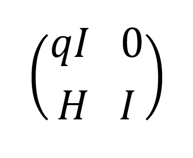

## Криптосистема будущего

| Событие | Название | Категория | Сложность |
| :------ | ---- | ---- | ---- |
| VKA-CTF`2021 | Криптосистема будущего | Crypto | medium |

### Описание

> Автор: iConst
>
>Штаб компании СССР 2.0 на спутнике Юпитера Ганимеда только что перехватил передачу по зашифрованному каналу компании Космос Х. К великой удаче, не всё было зашифровано в этом сообщении, в нём говорилось, что автопилотируемый грузовой корабль с ценными ресурсами на борту сбился с проложенного пути и вынужден был сделать посадку, только вот место посадки оказалось зашифровано. Руководство приняло решение снабдить космолёт, а перед его вылетом необходимо определить место экстренной посадки корабля. Помогите компании, внесите свой вклад в развитие! Зашифрованная часть сообщения представлена в файле:
(файлик)  

### Решение

Можно заметить, что представлена криптосистема [NTRUEncrypt](https://ru.wikipedia.org/wiki/NTRUEncrypt). В файле **ciphertext.txt** даны: открытый ключ (многочлен h), шифртекст (зашифрованный симметричный ключ) и зашифрованный симметричным ключом флаг. 

Очевидно, что, чтобы расшифровать флаг, требуется получить DES-ключ. 
Наибольший интерес представляет следующий блок кода: 

```python 
#----------------- Static params -----------------#
n = 64
p = 3
q = 2 ** 16
df = 23
dg = 22
dr = 22
```

Стойкость системы к атакам во многом зависит от параметра `n`. В данном случае он мал, что позволяет провести атаку на основе решётки. 


Для этого надо составить матрицу следующего вида: 


где I - единичная матрица размера n, H - [циркулянт](https://ru.wikipedia.org/wiki/%D0%A6%D0%B8%D1%80%D0%BA%D1%83%D0%BB%D1%8F%D0%BD%D1%82), образованный коэффициентами открытого ключа, q - параметр криптосистемы.

Применив алгоритм редукции базиса (например, LLL), вычисляется новая матрица, одна из строк которой содержит закрытый ключ `f`, с помощью которого легко расшифровать сообщение. 

[Решение](solve.sage)

**Флаг:**

> vka{D1d_W4NDER_dARKLING_In_THe_eTErNal_5paC3}
