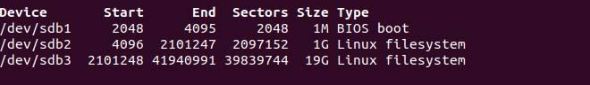
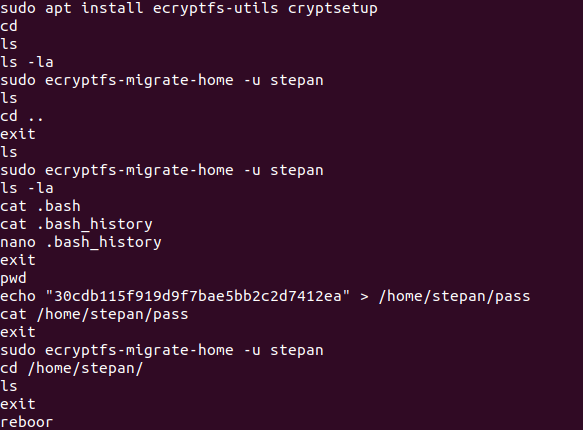
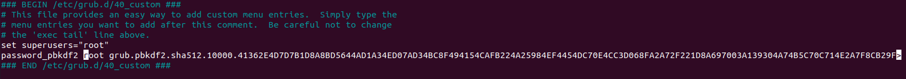
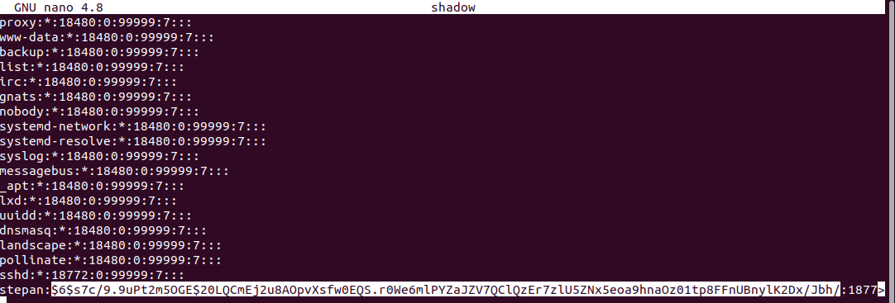
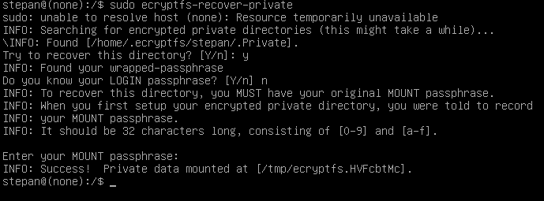

## Притча о Степане

| Событие | Название | Категория | Сложность |
| :------ | ---- | ---- | ---- |
| VKACTF 2021 | Притча о Степане | Forensics | medium |

### Описание

> Автор: WaffeSoul
>
> Степан работал на великую партию на великой станции планеты Венера, где он был рабочим № 427. Задача рабочего № 427 была одновременно простой и очень важной - он сидел за своим столом в комнате 427 и нажимал кнопки на клавиатуре. Приказы поступали к нему через экран монитора, сообщая, на какие кнопки нажимать, как долго и в каком порядке. Это то, что рабочий № 427 делал каждый день каждого месяца каждого года. И хотя другие считали это занятие монотонным, невыносимым и сводящим с ума, Степан наслаждался каждым моментом, он ощущал, что это его истинное предназначение. И Степан был счастлив. И вот однажды случилось нечто очень странное. Что-то, что навсегда изменит его жизнь. Что-то, чего он никогда не забудет. В самый разгар активной деятельности никогда ранее не выключавшийся компьютер перезагрузился и стал требовать пароль. Степан никак не мог ожидать от жизни такого подлого удара в спину, ведь теперь его важная задача не может быть выполнена. Без лишних слов, просто помоги Степану вновь обрести счастье.
[MEGA](https://mega.nz/file/8xpmDQrQ#rbTq_--FNgv2w8qcrY7YzaK1zwsqpyTYIx_46MYKb80)
[Яндекс](https://disk.yandex.ru/d/-MvOaqPrKw_9aw)  
[Google](https://drive.google.com/file/d/1u24MXTdBJLWUY1w_rfEfxXuO4Sx5Levw/view?usp=sharing)
Пароль: **qijd98hfja-w8u092u1foaowe;1** (в архиве Task.rar сломанный архив)

### Решение

Дан виртуальный ЖД от машины VMware. Запускаем, видим GRUB с паролем для того, чтобы снять пароль с GRUB и с пользователя подключаем диск к другой виртуальной системе.
Выполняем команду 
> sudo fdisk -l

Пробуем подключить логический диск /dev/sdb3. 
>sudo mount /dev/sdb3 /var/storage

Ответ:
> mount: /var/storage: unknown filesystem type 'LVM2_member'.

Чтоб исправить эту ошибку скачиваем lvm2 и выполняем ряд команд 
>sudo apt install lvm2

> sudo lvscan

>INACTIVE            '/dev/ubuntu-vg/ubuntu-lv' [<19.00 GiB] inherit

>sudo vgchange -ay

> sudo mount /dev/ubuntu-vg/ubuntu-lv /var/storage

Теперь есть доступ к файловой системе. И ищем флаг находим только отсылки к сюжету и подсказку с зашифрованной домашней директорией. Смотрим историю bash у root 
>sudo cat root/.bash_history

Видим зашифровку домашней директории Степана с помощью команды ecryptfs-migrate-home. И какой-то ключ. Это ключ для расшифровки директории без парольной фразы для команды 
>sudo ecryptfs-recover-private

Но для ее использования нужно зайти в систему. Для этого нужно "снести" пароль от GRUB и пользователя Stepan.
Для GRUB нужно убрать строчку в файле grub/grub.cfg на диске /dev/sdb2.

А для пользователя stepan в еtc/shadow убрать хеш пароля 

Заходим в систему за пользователя используем команду 
>sudo ecryptfs-recover-private

И ключ 30cdb115f919d9f7bae5bb2c2d7412ea

Заходим /tmp/ecryptfs.[RANDOM] и получаем там флаг

 
**Флаг:**

> vka{4nd_wh47_w45_7h47?_17_w45_6rub}