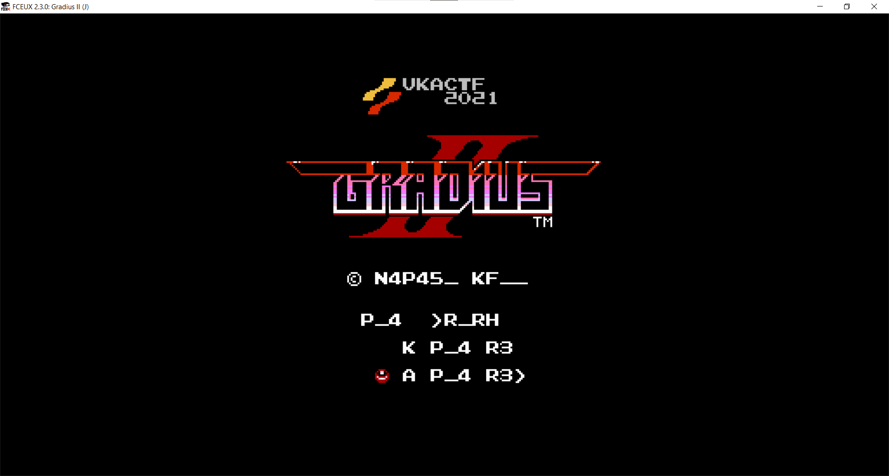

## Отцовская консоль

| Событие | Название | Категория | Сложность |
| :------ | ---- | ---- | ---- |
| VKACTF 2021 | Отцовская консоль | квест/stego | Easy |

### Описание

> Автор: WaffeSoul
>
> Алиса посмотрела на пылящуюся в углу папиного кабинета старенькую консоль NES. Для него она всегда была чем-то большим, чем игровая консоль - неким раритетом, теплыми воспоминаниями о далеком детстве. Все картриджи всегда аккуратно лежали на полочке, каждый на своем месте. Однако когда Алиса попыталась вставить туда их любимую с папой игру, она с удивлением обнаружила, что в консоле уже находится какой-то картридж, который она до этого никогда не видела. Определенно, стоит его изучить.
 

### Решение

Дан файл game. Проверяем его через file.
> game: NES ROM image (iNES): 8x16k PRG, 16x8k CHR [H-mirror]

Идем в гугл, находим, что это игра на NES. Ищем эмуляторы, например можно взять 1 из них:
1. FCEUX
2. Nestopia v1.40 
3. iNES

Запускаем игру:

Первое, что видно это измененный текст, а также логотип. Текст можно было изменить с помощью кода, но не логотип. Значит стоит искать редактор изображений(тайтлов/спрайтов) для rom nes. (хорошая [статья](https://habr.com/ru/post/470614/) по описанию работы графики в nes) Например, [YY-CHR](https://shedevr.org.ru/cgi-bin/utilz.cgi?n=4) запускаем  ищем алфавит и там вместо него флаг.

 
**Флаг:**

> vka{4l1c3_f1nd_m3_1_b3l13v3_1n_y0u}