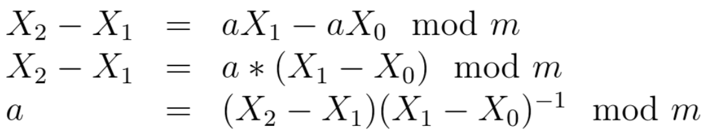

## Лотерея

| Событие | Название | Категория | Сложность |
| :------ | ---- | ---- | ---- |
| VKA-CTF`2021 | Лотерея | Crypto | easy |

### Описание

> Автор: iC0nst
>
> Алисе необходимо как-то улететь с Земли. Она ходила туда-сюда по комнате и долго думала, но так и не придумав чего-то дельного, разочарованно уселась на диван. Включила телевизор, начала бегло перелистывать бесконечные каналы, пока её внимание не увлекла удивительная реклама, предлагающая поучаствовать в [розыгрыше лотерейного билета](https://lottery.vkactf.ru). Одна крупная корпорация предлагала испытать удачу и отправиться в космический тур на Марс совершенно бесплатно. Алиса решила не упускать свой шанс и подала заявку на участие.
[файл](give/source.py)

### Решение

Сервис собой представляет сайт, пользователи которого могут принять участие в лотерее.

При регистрации для каждого пользователя генерируются параметры линейного конгруэнтного генератора.

Зайдя в личный кабинет предлагается заполнить 3 лотерейных билета. В случае угадывания всех 4 чисел в одном из них пользователь считается победителем. 

Ход решения:
1. Заполнить первые 2 билета произвольными числами:

2. Надо восстановить все параметры генератора. Для этого построим последовательность:

   Где  - это подряд идущие правильные числа.  

3. Определив модуль, находим a как:

4. Находим с:

5. После чего найдем еще 4 члена последовательности(3 билет), тем самым выигрываем путёвку. 

**Флаг:**

> vka{give_yourself_a_chance_to_visit_space}
