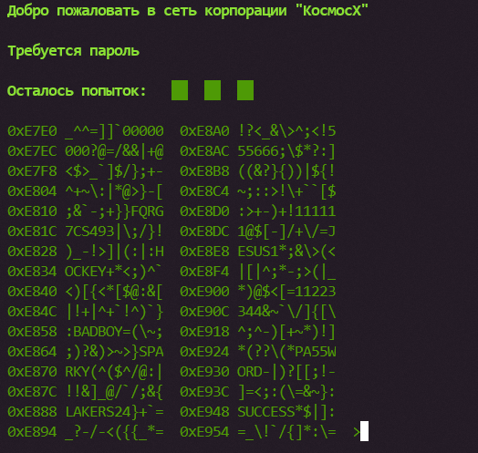
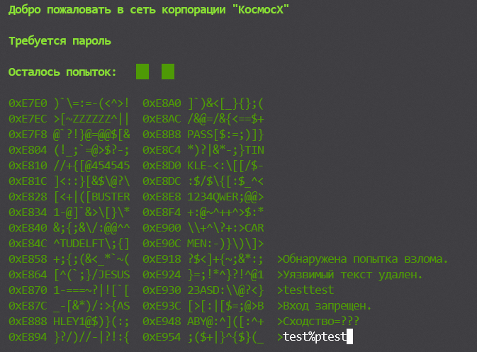
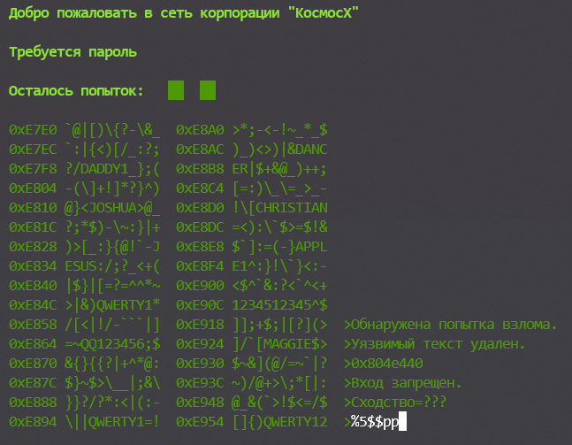
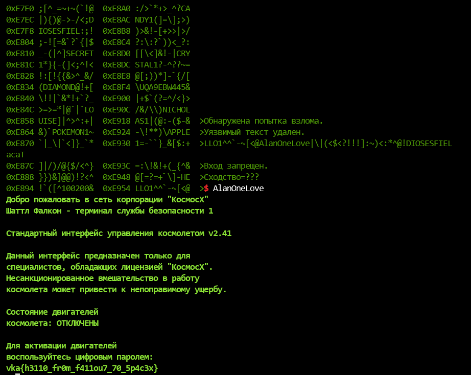

## Совершенно секретно

| Событие | Название | Категория | Сложность |
| :------ | ---- | ---- | ---- |
| VKACTF 2021 | Пип-Бой | Pwn | Лёгкий |

### Описание

> Автор: b1n4r9
>
> Алиса направляется прямиком в космопорт, веря только в чудо и свою верную боевую Raspberry Pi, которую она назвала Пип-Бой. Спрятавшись в контейнер грузовика, она попадает прямиком в ангар, где находится заветный космолет. Однако вход на корабль закрыт, терминал шлюза приветливо моргает и просит пароль. Алисе уже приходилось ломать защитные системы Космос Х в школе, чтобы обеспечить себя бесконечным запасом газировки, однако этот терминал просто так не поддается, ее Пип-Бой не работает должным образом - экран терминала меньше, чем требуется, возможный пароль может находиться где-то за его пределами. Ко всему прочему, прошивка выглядит новой, могли быть добавлены дополнительные средства защиты. Видимо, придется взламывать на месте.
>
> `nc 65.21.151.249 43000`

### Решение

Пользователю дается терминал с выводом дампа некоторого участка памяти. Бинарный сервис доступен только удаленно, без исполняемого файла. Терминал приветственно просит ввести пароль. Неправильная попытка ввода возвращает информацию об ошибке.

В дампе памяти можно заметить много паролей (отсылка к взлому терминала в игре Fallout). Описание задания также говорит о некорректной работе программы по взлому - "однако этот терминал просто так не поддается, ее Пип-Бой не работает должным образом - экран терминала меньше, чем требуется, возможный пароль может находиться где-то за его пределами".

Значит необходимо сдампить пароль, лежащий за пределами указанных в терминали адресов.

Единственная пригодящая на ум уязвимость - уязвимость форматной строки.

При попытке уязвимого ввода получаем следующую информацию. Также можно заметить, что уязвимый ввод меняется на пустую строку.

Для данной проверки существует обход - `%%pp` - программа делает замену нерекурсивно. Тоже самое и касается взятия значения по индексу - `%5%%pp`.

В первую очередь узнаем константные части адресов. Адрес со стека `0x804e440` говорит о том, что программа скомпилирована в x32 формате и имеет префикс `0804`. Следующим шагом эксплуатируем саму уязвимость форматной строки - читаем значение по адресу. Может прочитать как по последнему из видимых адресов внизу справа - строка сконкатенируется и выведет пароль, так и прибавить 12 байт смещения каждого выводимого участка хексдампа и сразу вывести пароль.

[ЭКСПЛОИТ](exp.py)

**Флаг:**

> vka{h3110_fr0m_f411ou7_70_5p4c3x}
