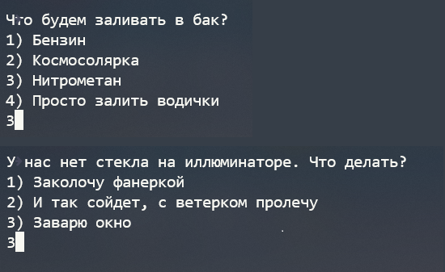
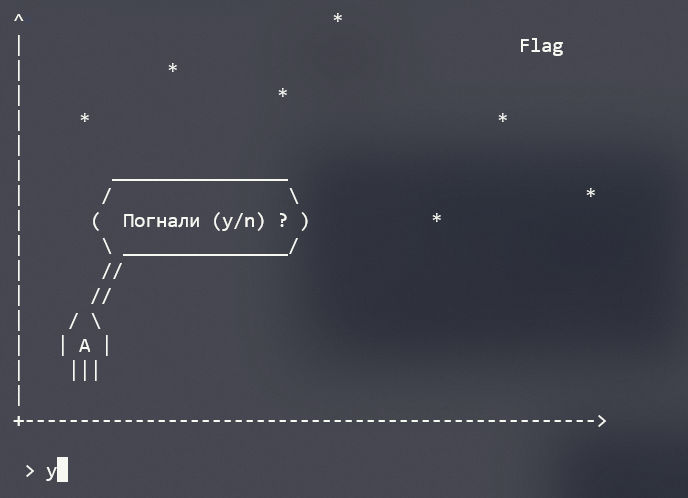
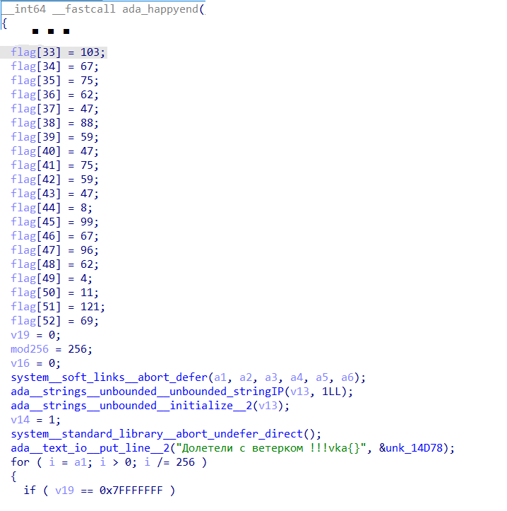

## Космический музей

| Событие | Название | Категория | Сложность |
| :------ | ---- | ---- | ---- |
| VKACTF 2021 | Космический музей | Reverse | easy |

### Описание

> Автор: Rex
>
>Обдумывая варианты своего путешествия до Марса, Алиса стояла у окна и смотрела на оживленную улицу. Напротив образовалась большая очередь у входа в какое-то здание. Да это же музей космонавтики, в котором сегодня день открытых дверей! Изучив экспонаты, Алиса с удивлением обнаружила секцию списанных десятилетия назад космолетов. Слившись с посетителями, Алиса пробралась внутрь одного из них и выяснила, что корабль все еще пригоден для полетов, однако защищен специальной алгоритмом от таких вот незваных гостей. Сегодня ночью она найдет на просторах даркнета его прошивку, разреверсит и заставит эту пташку взлететь.

### Решение

В задании дан **ELF**. Как бы я не хотел ответить "космосолярка" и "заколочу фанеркой", придется выбрать нитрометан и заваренное окно. 

  

Пройдя простые проверки, запускаем основной функционал. 



Бинарь не стрипнут, поэтому все сохранилось в первозданном виде. Прежде всего внимание привлекает функция **happyend**. Флаг зашифрован простым xor-ом с неопределенной длинной ключа.



**Happyend** вызывается из **rocket**, в ней же вызывается run, содержащая основной функционал программы. Функция **run** представляет собой механизм обхода графа (наших планет). Матрица смежности задается в явном виде

```c++
s[1] = 47263;
s[2] = 51399;
s[3] = 61905;
s[4] = 42458;
s[102] = 55220;
s[103] = 28180;
s[104] = 22990;
s[105] = 13181;
s[203] = 47319;
s[204] = 64794;
s[205] = 18172;
...
```

Имена планет для перехода соответственно A1, A2, A3, A4, A5, A6, A7, A8, A9, A0 ...
Найдем уже готовое решение на [гите](https://github.com/valandro/python-dijkstra), обходим граф и находим кротчайший путь

```bash
python3 ./dijkstra.py prepare5.txt
-- Minimun Cost --
0xb703f
```

Восстанавливаем алгоритм расшифровки

```python
flag = [103,67,75,62,47,88,59,47,75,59,47,8,99,67,96,62,4,11,121,69]
key = [0xb,0x70, 0x3f]

for i in range(len(flag)):
  j = i % len(key)
  flag[i] = flag[i] ^ key[j]

for i in flag:
  print(chr(i), end="")
```

И получаем наш флаг

**vka{l3t5_g0_t0_7h3_5t4r5}**
