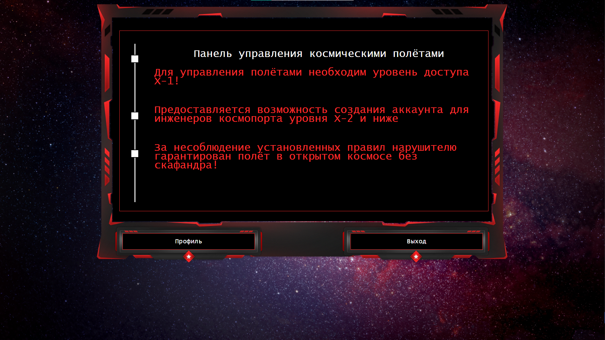

## Управление полётами

| Событие | Название | Категория | Сложность |
| :------ | ---- | ---- | ---- |
| VKACTF 2021 | Управление полётами | Web | easy |

### Описание

> Автор: [ 𝕂𝕣𝕒𝕦𝕤𝕖 ]
>
> Радость быстро сменилась грустью, теперь стоял вопрос, как, не имея космического корабля, добраться до Плутона. Друг отца сразу смекнул из-за чего перемена настроения и проговорил: 
>
> — Ради такого человека, как твой отец, и стоит достать мой старенький космический корабль, топлива в нём хватит и на полёт до Плутона, и на полёт до дома. Только есть одна проблема, просто так с Марса нельзя улететь. Нужно специальное разрешение, а получить его очень трудно.
>
> — Но ведь как-то же можно подделать разрешение?
>
> — Не знаю, тебе нужно проникнуть к одному управляющему терминалу. Я тебя туда отведу и дам тебе ещё всю информацию по кораблю, всё, что вероятно может понадобиться. Старик привёл Алису к командному пункту неподалёку и помог ей пробраться незаметно к заветному терминалу. Теперь всё зависело от навыков Алисы. Перед ней предстала [панель управления](https://ship-control.vkactf.ru), особый доступ к которой разрешен только привилегированному пользователю. Действовать надо быстро, пока никто не пришёл.


### Постописание
> Войдя в терминал, Алисе ничего не мешало внести все данные для разрешения полёта. После она незаметно выбралась оттуда, и радостная помчалась к дому друга отца. Перед отлётом она поблагодарила его.

### Решение


На сайте есть возможность создания аккаунта. Сеанс пользователя хранится в JWT токене. В профиле обычного пользователя скрыт некий токен доступа. Необходимо стать админом для просмотра скрытой информации

Заголовок JWT токена содержит путь до файла с секретным ключом:
```json
{"typ":"JWT","alg":"HS256","kid":"keys/secret.key"}
```
Тело токена содержит информацию о привилегированности пользователя:
```json
{"username":"alice","admin":false}
```
Используя эту информацию мы можем изменить в теле токена `false` на `true`:
```json
{"username":"alice","admin":true}
```
 а подписать его публичным файлом, например, файлом стилей либо изображением, указав соответствующий путь до файла в заголовке токена:
```json
{"typ":"JWT","alg":"HS256","kid":"static/css/terminal.min.css"}
```
Заходим в профиль и получаем флаг

**Флаг:**

> vka{51mpl3_xp47h_vuln3r4b1l17y}