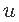
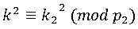

### Старая база

| Событие | Название | Категория | Сложность |
| :------ | ---- | ---- | ---- |
| VKA-CTF`2021 | Старая база | Crypto | hard |

### Описание

> Автор: Dart Vader / iC0nst
>
>Прибыв на Плутон, девочка обнаружила какую-то заброшенную тюрьму, а вокруг ни души. Алиса нашла панель управления, на экраны выводилась запись с камер. По камерам видно, что внутри есть люди. Их надо выпустить, может они что-то знают об отце! Дальнейшее исследование навело Алису на необычную охранную систему, для получения доступа надо ввести расшифрованную фразу. Странный алгоритм, что-то знакомое . . .

> nc 65.21.151.249 23000
[файл](give/main.py)
### Решение
К сожалению, из-за случайной ошибки в исходник попал секретный ключ, который предполагалось найти и который необходим был для расшифровки и получения флага, это все существенно облегчало таску. Дальше представлено, как таска задумывалась и должна была решаться. 
Имеется сервис по обмену ключами по протоколу Диффи-Хеллмана на ЭК с предоставлением исходных кодов. Есть возможность зашифровать какие-лмбо данные, используя собственную точку ЭК, флаг же выдается в зашифрованном виде через AES CBC на приватном ключе , верхний предел  которого известен, также известен открытый ключ .
В общем виде атака имеет название: ["Invalid Curve Point Attack"](https://github.com/ashutosh1206/Crypton/blob/master/Diffie-Hellman-Key-Exchange/Attack-Invalid-Curve-Point/README.md).

Проведение атаки на данный сервис:

1. При исследовании исходных кодов можно прийти к выводу, что поданные на вход точки ЭК не проверяются на принадлежность данной кривой. Также из формулы сложения точек известно, что параметр  в нем не участвует. Из этого следует главный вывод, что на вход можно подавать любые точки, которые без проблем будут участвовать в вычислении общего ключа.

2. Необходимо сгенерировать несколько кривых (~40), для этого необходимо перебирать  = 1...40 и находить порядок этих кривых, выбирать следует те, у которых в разложении порядка есть множители до 10 000 (этого вполне будет достаточно):

, где порядок кривой - ;

, где порядок кривой - ;

и т.д.

3. Имея базовую точку  i-ой ЭК сгенерировать точку с порядком до 10 000:
 , где 1000<<10000 и является простым.

4. Полученные точки послать на вход программы вместе с любым сообщением, получить зашифрованное сообщение. 

5. Так как ключом для зашифрованных сообщений является координата X от точки  то можно определить , перебрав ключи для AES CBC, имея пару открытый текст-зашифрованный текст. 
   Так как,  , то чтобы исключить неопределенность, необходимо поставить вопрос нахождения , тогда нас будет интересовать нахождение .

6. Таким образом получим множество:

;

;

;

   и т.д.

   Далее необходимо использовать Китайскую теорему об остатках , помним, что , чтобы можно было извлечь квадратный корень. 

7. Извлекаем квадратный корень и получаем приватный ключ , проверяем, что . Получаем зашифрованный флаг и расшифровываем его.

**Флаг:**

> vka{there_is_no_point_to_be_invalid_point}
