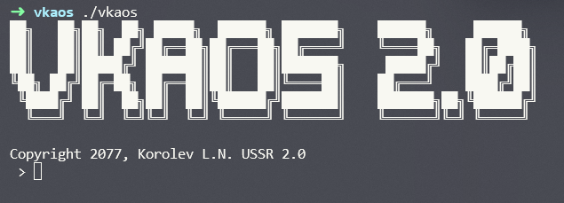
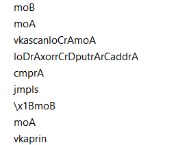
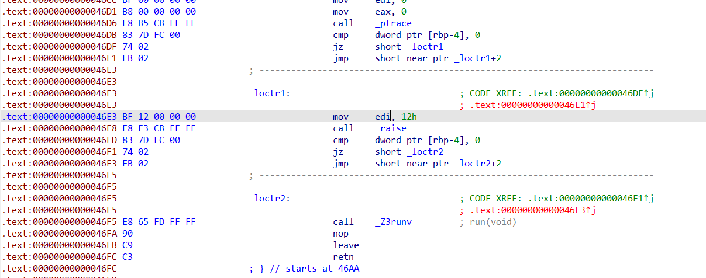
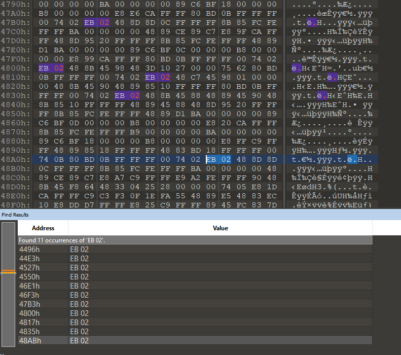
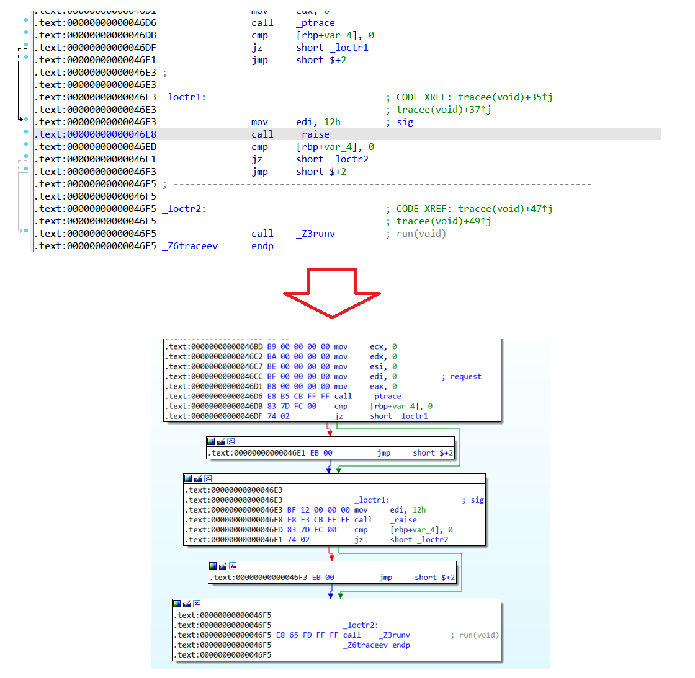
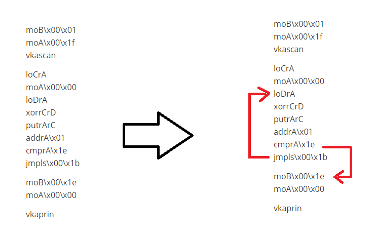
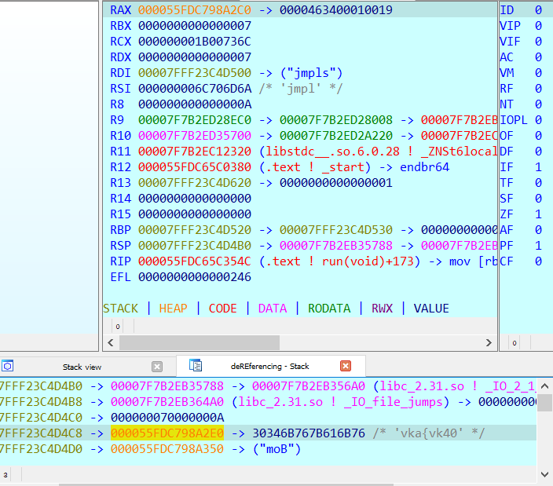
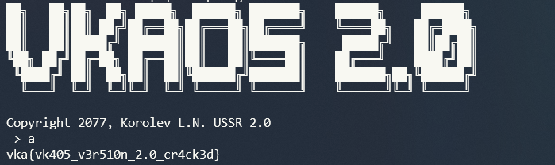

## Прогрессивная ОС

| Событие | Название | Категория | Сложность |
| :------ | ---- | ---- | ---- |
| VKA-CTF`2021 | Прогрессивная ОС | Reverse | easy |

### Описание

> Автор: Rex
>
>В свое время импортозамещение добралось во все сферы жизни, но сделать качественную операционную систему всё никак не удавалось. Наши шпионы выкрали тестовый образец операционной системы коммунистов. Такая система должна была стоять в местах обработки совершенно секретной информации, а значит защита её должна быть соответствующего уровня. Помогите нашим специалистам взломать новую систему и добраться до её ядра!

### Решение

В задании дан ELF файл, представляющий якобы операционную систему VKAOS 2.0

Анализ строк может уже подсказать, что в задании будет применена технология виртуализации

В задании применяются 2 способа обнаружения отладчика (ptrace и он же, но используя другой поток), убрав их сталкиваемся с новой проблемой - ида не всегда может построить граф потока управления

Дизассемблеру мешают инструкции jmp short near ptr loc+2, значение в hex - EB 02

Запатчим EB 02 на EB 00

После исправления:

Последний этап - реверс виртуальной машины

Код для исполнения следующий:

После считывания символа, строка (флаг) расшифровывается с помощью него. Сбрутить алгоритм достаточно просто. Ключ для расшифровки 0xcd, в результате расшифровки получаем флаг

Введя любой читаемый символ и запатчив его на 0xcd и продолжим выполнение

