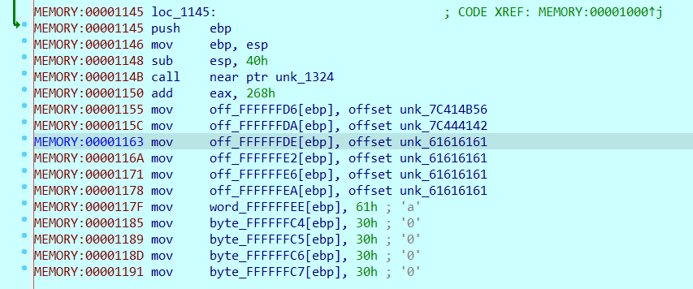
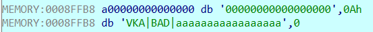
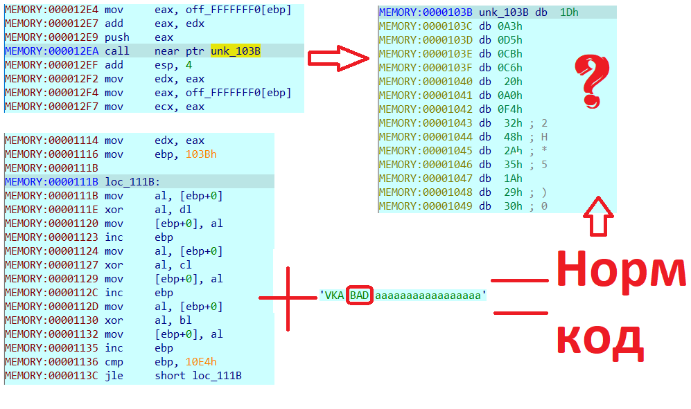
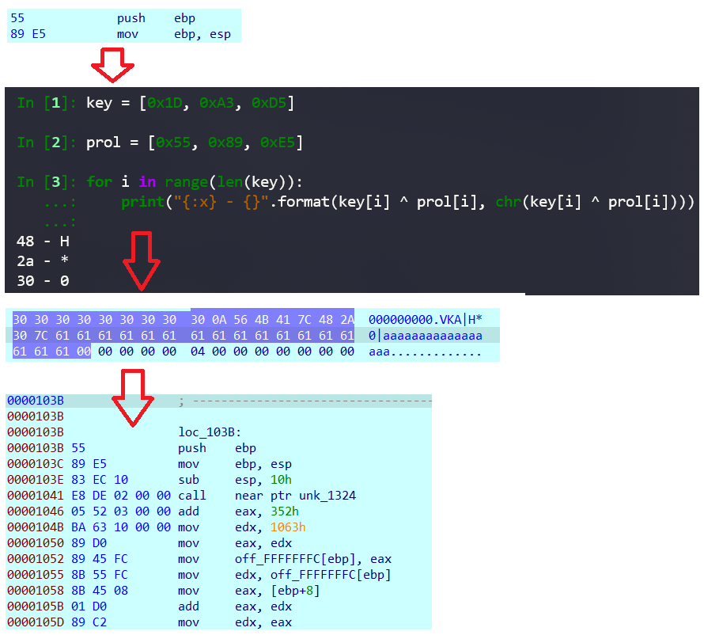
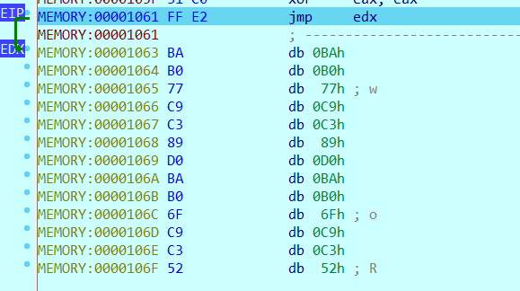
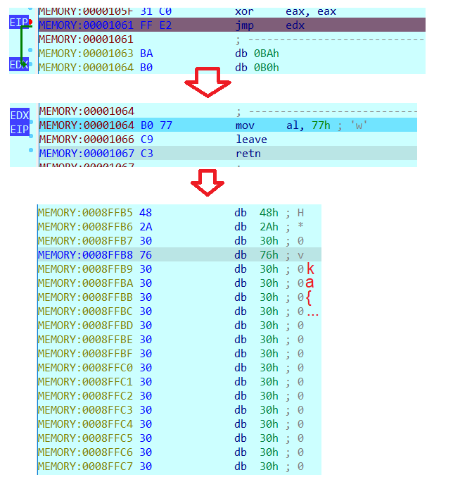
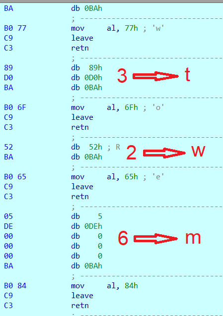

## Сломанный загрузчик

| Событие | Название | Категория | Сложность |
| :------ | ---- | ---- | ---- |
| VKACTF 2021 | Сломанный загрузчик | Reverse | medium |

### Описание

> Автор: Rex
>
>Один из наших агентов в компании Космос Х работал плотно с их роутерами и недавно смог передать в отдел безопасности прошивку одного из них. Что ж, посмотрим, что у них там внутри может быть интересного. Наши специалисты уже работают над ним, нам не помешала твоя помощь, товарищ!

### Решение

Первым делом смотрим file-ом и видим "DOS/MBR boot sector"

Запускаем для отладки 
```
qemu-system-i386.exe -s -S kernel.img
```
И аттачимся идой. С 0x1000 начинается интересующий нас код



По ходу исследования не трудно заметить следующие строки



Вторая используется как заголовок, где просто проверяется VKA|, далее BAD используется как ключ для расшифровки части исполняемого кода



Процедура шифрования основана на xor, ключ для расшифровки строго фиксированной длины 3. Восстановим код по прологу



Далее следуем ко второму интересному моменту (и тут уже закрадывается мысль - зачем нам нужна была строка "aaaaa..."). Посмотрим на то, как совершается данный прыжок



Размер прыжка контролируется следующим образом


```python
m1 = [0x05,0x14,0x09,0x01,0x03,0x08,0x13,0x19,...] # len = 26
m2 = [0x0,0x0,0x6,0x0,0x0,0x0,0x4,0x0,0x0,0x0,0x0,...] # len = 26
m2[ m1[0] ]
```

Прибавляя длину предыдущего прыжка. Можем заметить, что встречаются прыжки на 1, 2...6. Попробуем их поочередно выполнить. Выполним поиск букв необходимых для прыжка. 
```
a -> 0
b -> 1
c -> 0
d -> 0
e -> 0
f -> 0
g -> 0
h -> 0
i -> 0
j -> 0
k -> 0
l -> 0
m -> 6
n -> 0
o -> 0
p -> 0
q -> 0
r -> 0
s -> 4
t -> 3
u -> 0
v -> 0
w -> 2
x -> 5
y -> 0
z -> 0
```


Для прыжка на 1 необходимо ввести b.



Дойдя до записи конечного результата можем наблюдать постепенно складывающийся флаг. Теперь необходимо подобрать соответствующие прыжки, чтобы его собрать.



В конечном итоге заголовок **VKA|H\*0|btwmsxwtxsbwwtsmb** позволяет нам получить флаг

*vka{fl46_1n_b007}*
