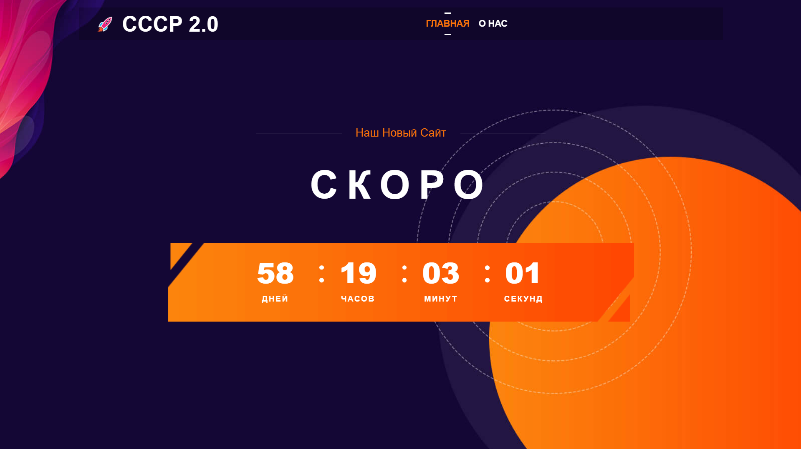
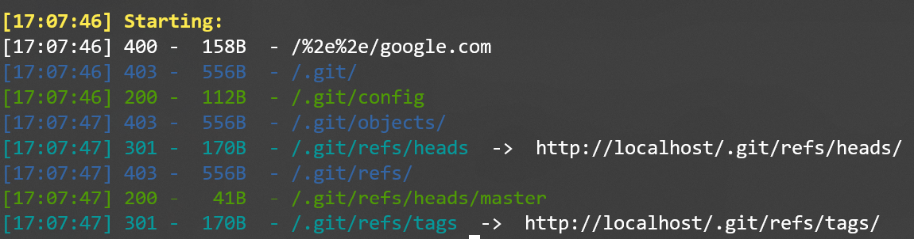

## Система мониторинга

| Событие | Название | Категория | Сложность |
| :------ | ---- | ---- | ---- |
| VKACTF 2021 | Система мониторинга | Web | medium |

### Описание

> Автор: [ 𝕂𝕣𝕒𝕦𝕤𝕖 ]
>
> Один из наших сотрудников недавно выведал интересную информацию. Ученый, прибывший с Венеры на Землю и работавший на компанию СССР 2.0, выпил в баре и начал хвастаться своему товарищу и проболтался о кое-чём секретном. Он рассказал о разработке единого приложения для мониторинга всех космических кораблей. Также он рассказал, что руководство его компании очень интересуют загадочные недавно появившиеся из ниоткуда космические пираты, которые не только воруют ценные ресурсы, но и людей. Он поделился с нами [тестовой версией](https://in-developing.vkactf.ru) этого приложения. Нужно разобраться с механизмами работы, такая система и нам не помешает!

### Решение


На сайте отсутствует какая-либо функциональность. Используем приложения для поиска директорий, чтобы найти файлы разработки `.git`


На сервере отсутствуют `git` файлы `HEAD` и `index`, необходимые для приложений, которые в автоматическом режиме скачивают все файлы. Следовательно все действия необходимо проделать вручную, начиная с `/.git/refs/heads/master`

> Подробнее про объекты `git` можно прочитать [здесь](https://git-scm.com/book/ru/v2/Git-%D0%B8%D0%B7%D0%BD%D1%83%D1%82%D1%80%D0%B8-%D0%9E%D0%B1%D1%8A%D0%B5%D0%BA%D1%82%D1%8B-Git)

Создадим необходимые файлы, чтобы можно было использовать команды git. Минимальная структура проекта следующая:
```
./.git/
├── HEAD
├── objects
└── refs
    └── heads
        └── master
```

В `/.git/refs/heads/master` хранится sha1 сумма `46c8eecc24016c8c0972996532ee8838302003f3`. Создадим директорю `objects/46/` и сохраним в неё файл с сервера `/.git/objects/46/c8eecc24016c8c0972996532ee8838302003f3`

Данный объект (как и все) хранится в сжатом виде. Для его прочтения воспользуемся командой `git cat-file`
```bash
$ git cat-file -p 46c8eecc24016c8c0972996532ee8838302003f3
```
и получаем содержимое крайнего коммита
```
tree 4d50e73c79739492aec32bb4915925751a52b4e0
parent 49bd3093f3e3e2b8ff2470fa9395fb2376a4f72c
author John Doe <johndoe@example.com> 1620040411 +0300
committer John Doe <johndoe@example.com> 1620040411 +0300

Removed caching. Remember to restart the server!
```
В данном коммите мы видим следующие объекты. Повторив эти действтия со всеми объектами, мы восстановим git проект.

Из истории коммитов видим, что на сервере используется кэширвание страниц. Чтобы получить флаг, необходимо отправить GET параметр запроса `need_flag`, но страница закэширована, а повторить кэширование можно не скоро.

Для получения другой сохранённой страницы необходим другой ключ кэша. В директории `utils` находим файл, который в зависимости от наличия заголовка запроса `haxo0or` со значением `need_flag` отдаёт соответствующий ключ кэша. Используя его и get параметр запроса получаем страницу с флагом.

**Флаг:**

> vka{d3v3l0pm3n7_f1l35_5h0uld_n07_b3_4v41l4bl3_70_3v3ry0n3}